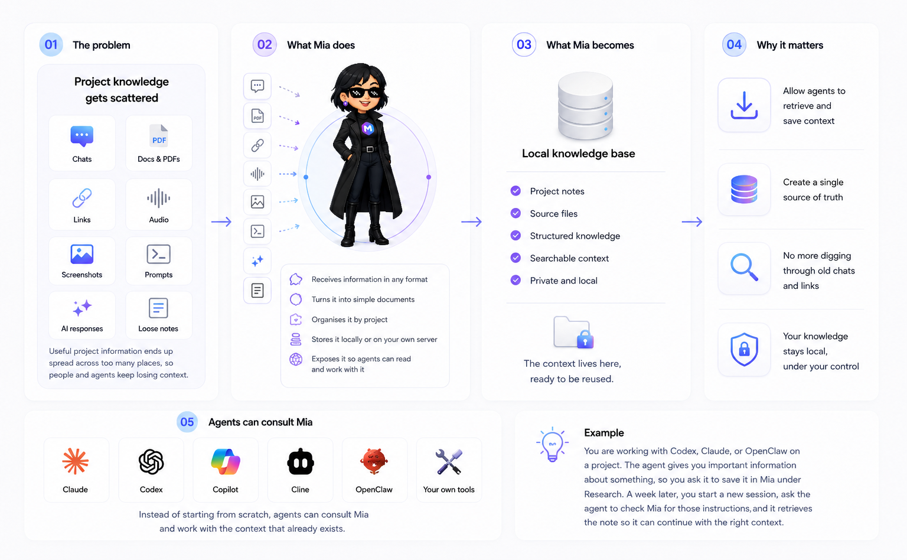

## Welcome to Mianotes 

Mianotes is a local-first knowledge app for humans and AI agents. It turns files, links, images, audio, and text into organised Markdown notes that people can read, edit, and share, while AI agents can search, update, and maintain them through APIs and MCP.

💡 The idea is simple: `Markdown` files become your shared working memory.

Humans use the web app to organise notes, folders, links, documents, and summaries. Agents use the API to retrieve context, save decisions, update notes, and keep knowledge useful over time.

Mianotes stores knowledge as plain Markdown files on the filesystem, so your notes stay portable, readable, and easy to run locally on your computer or on your own server.

## Meet Mia

Mia is the built-in AI agent for Mianotes. It helps turn messy inputs into clean notes by extracting key information, summarising content, adding structure, and preparing knowledge for reuse by humans, agents, and tools like Claude, Codex, OpenClaw, Cursor, VS Code, and Slack.

## Use cases

- **For developers**: Give AI agents a local, structured place to store and retrieve project knowledge, decisions, docs, and implementation notes.
- **For researchers**: Keep research notes, links, papers, documents, prompts, and summaries tagged and organised in one searchable knowledge hub.
- **For students**: Upload notes, book pages, slides, whiteboards, or lectures, then ask Mia to turn them into clean Markdown notes.
- **For small teams**: Keep shared context, meeting notes, decisions, links, files, and agent output in one local-first workspace.
- **For families**: Save homework, receipts, trip plans, instructions, and everyday notes, then ask Mia to summarise, improve, or restructure them.
- **For agents and tools**: Give agents and tools a knowledge base they can search, update, and use without asking humans for permission.

