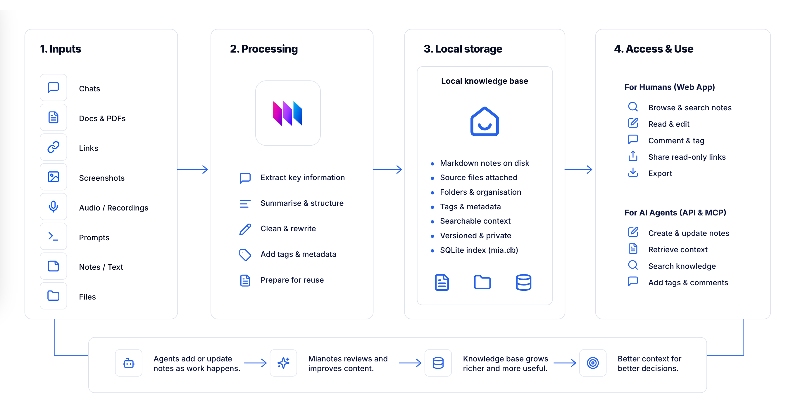

## Welcome to Mianotes 

Turn any folder into a searchable knowledge hub.

Mianotes converts notes, meeting recordings, videos, articles, documents, images, and AI output into clean Markdown you can search, organise, edit, and reuse. Keep it local, share it with your group, or publish selected notes when you need to.

Mianotes gives people and AI agents the same workspace. You might upload a PDF and ask Mia to turn it into a clean note. An agent might create a folder for a task, write implementation notes as it works, attach source material, then update the note when the work changes. Another agent can later search those notes and continue from the same context.

The web app is the human control room. The REST API and MCP server are the agent interface. Your knowledge stays private, portable, readable, and easy to run locally on your computer or on your own server.

## Meet Mia

Mia is the built-in AI agent for Mianotes.

Mia helps your agents document the project as they work. It turns inputs into clean Markdown notes, extracts useful information, adds structure, and prepares your knowledge so humans and AI agents can reuse it.

## Use cases

- **For developers**: Let AI agents document decisions, changes, implementation notes, and project context while they work.
- **For agents and tools**: Give agents and tools a knowledge base they can search, update, and maintain as they work.
- **For students**: Upload notes, book pages, slides, whiteboards, or lectures, then ask Mia to turn them into clean Markdown notes.
- **For small teams**: Keep shared context, meeting notes, decisions, links, files, and agent output in one local-first workspace.
- **For researchers**: Keep research notes, links, papers, documents, prompts, and summaries tagged and organised in one searchable knowledge hub.
- **For families**: Save homework, receipts, trip plans, instructions, and everyday notes, then ask Mia to summarise, or improve them.
